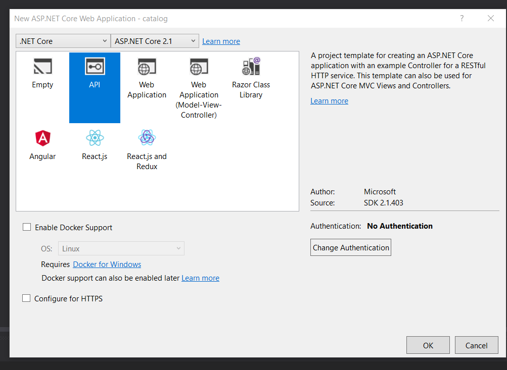
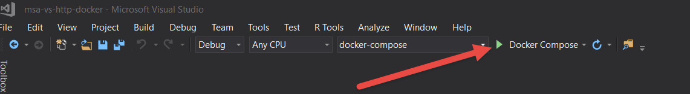
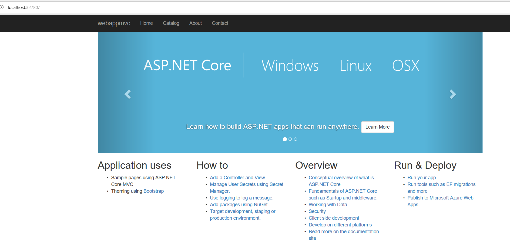
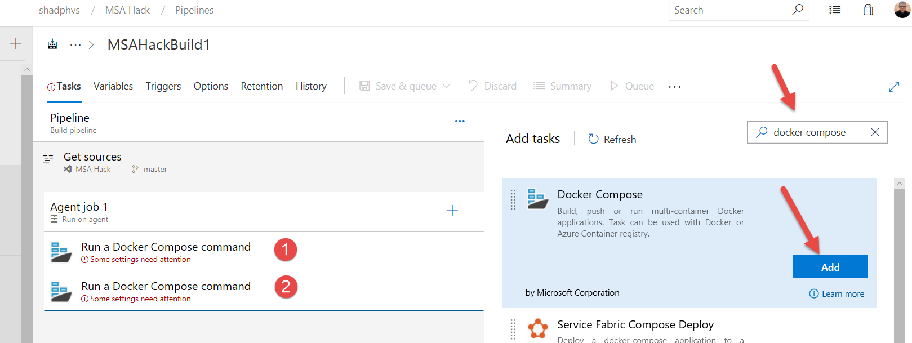
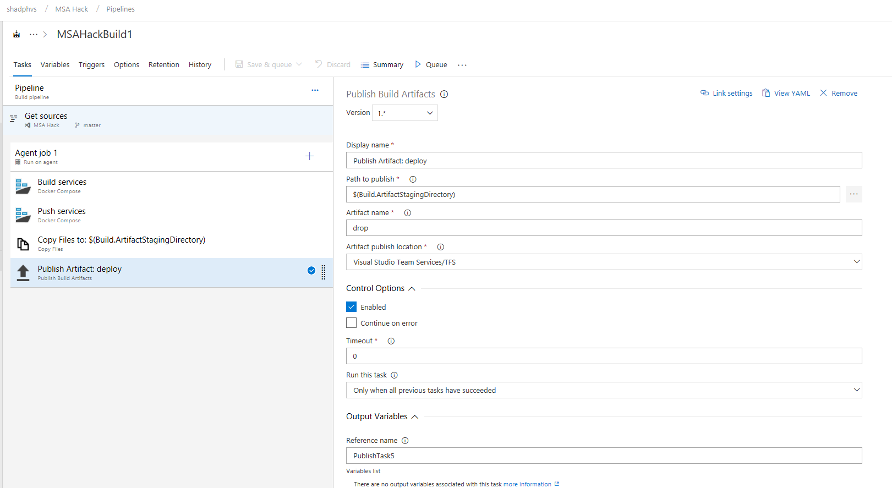
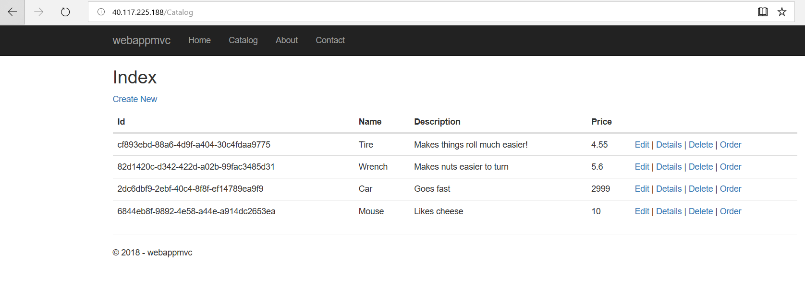

# CSA Hackathon : Microservices on Azure
## Overview

Deploying a sample Microservices Architecture on Azure using .NET Core C# and Visual Studio

## Pre-requisites 
* .NET Core 2.1 SDK [download](https://www.microsoft.com/net/download/dotnet-core/2.1)
* Install Visual Studio 2017 [here](https://docs.microsoft.com/en-us/visualstudio/install/install-visual-studio?view=vs-2017)
* Docker [download](https://docs.docker.com/docker-for-windows/install/)
* Get started with Docker for Windows [here](https://docs.docker.com/docker-for-windows/)
* A provisioned Cosmos DB in Azure [here](https://docs.microsoft.com/en-us/azure/cosmos-db/create-sql-api-dotnet#create-a-database-account)

## Recommended Reading
* Dependency Injection(DI) or Inversion of Control(IoC) [here](https://docs.microsoft.com/en-us/aspnet/core/fundamentals/dependency-injection?view=aspnetcore-2.1)
* Create a WEB API with ASP.NET Core and VS Code [here](https://docs.microsoft.com/en-us/aspnet/core/tutorials/web-api-vsc?view=aspnetcore-2.1#add-support-for-entity-framework-core)

## We are going to create a solution that has the following projects

* webappmvc - Asp.Net MVC applicaiton to service as our client application
* catalog - Asp.Net Web API application to serve as a catalog service
* models - Class library for model defenitions and Azure services context like CosmosDB

## Goals of the Lab
1. Create a Microservices Solution that has the following services
    * webappmvc - Asp.Net MVC applicaiton to service as our client application
    * catalog - Asp.Net Web API application to serve as a catalog service
    * models - Class library for model definitions and Azure services context like CosmosDB
1. Deploy the Services using AKS using CI/CD Azure DevOps Pipelines

## Exercises

* [Deploy ACR AKS and CosmosDB](#deploy-acr-aks-and-cosmosdb)
* [Create the Visual Studio 2017 Solution](#create-the-visual-studio-2017-solution)
* [Create Models Class Library](#create-models-class-library)
* [Develop the catalog project](#develop-the-catalog-project)
* [Develop the webappmvc project](#develop-the-webappmvc-project)
* [Debug the solution](#debug-the-solution)
* [Add AKS Docker Orchestration to the solution](#add-aks-docker-orchestration-to-the-solution)
* [Azure DevOps CI CD Deploy and Release Pipelines](#azure-devops-ci-cd-deploy-and-release-pipelines)

## Deploy ACR AKS and CosmosDB
### [Back to Excercises](#exercises)
1. Let's deploy all the required Azure Services (ACR, AKS, CosmosDB)
    ```powershell
    az login
    az account set --subscription <your subscription name>

    #create resource group
    az group create --name <your rg name> --location eastus

   #create cosmos db account
    az cosmosdb create –n '<your account name>' -g '<your rg name>' 

    # List cosmosdb account keys
    az cosmosdb list-keys --name '<your account name>' --resource-group '<your rg name>'
    az cosmosdb show --name '<your account name>' --resource-group '<your rg name>'

    #create Azure Container Registry (ACR)
    az acr create --resource-group <your rg name> --name <your acr name> --sku Basic

    #create Azure Kubernetes Services (AKS)
    az aks create --resource-group <your rg name> --name <your aks name> --kubernetes-version 1.11.3 --node-count 1 --enable-addons monitoring --generate-ssh-keys
    az aks install-cli
    az aks get-credentials --resource-group <your rg name> --name <your aks name>

    kubectl create clusterrolebinding kubernetes-dashboard -n kube-system --clusterrole=cluster-admin --serviceaccount=kube-system:kubernetes-dashboard

    az aks browse --resource-group <your rg name> --name <your aks name>

    ```
1. Now let's grant AKS access to ACR. Your AKS service will need this in order to pull images from ACR for deployments.
    ```powershell
    $AKS_RESOURCE_GROUP="<your aks rg name>"
    $AKS_CLUSTER_NAME="<your aks name>"
    $ACR_RESOURCE_GROUP="<your acr rg name>"
    $ACR_NAME="<your acr name>"

    # Get the id of the service principal configured for AKS
    $CLIENT_ID=$(az aks show --resource-group $AKS_RESOURCE_GROUP --name $AKS_CLUSTER_NAME --query "servicePrincipalProfile.clientId" --output tsv)

    # Get the ACR registry resource id
    $ACR_ID=$(az acr show --name $ACR_NAME --resource-group $ACR_RESOURCE_GROUP --query "id" --output tsv)

    # Create role assignment
    az role assignment create --assignee $CLIENT_ID --role Reader --scope $ACR_ID
    ```
## Create the Visual Studio 2017 Solution
### [Back to Excercises](#exercises)

1. Open Visual Studio 2018 > File > New > Project > Other Project Types > Visual Studio Solutions > Blank Solution
1. Name the solution 'msa-vs-http-docker' 
1. Change the location to your local repo like 'c:\repos\' and hit OK
1. Add Assets and resolve dependencies
    
## Create Models Class Library
### [Back to Excercises](#exercises)

1. In the Solution Explorer, right click on the 'msa-vs-http-docker' solution > Add > New Project > .NET Core > Class Libarary(.NET Core) and name it models
    
1. Click OK. 
1. In the solution manager in the Models Project right click on Dependencies > Manage NuGet Packages.
1. This will open Nuget Package manager where will add the required NuGet packages
1. In the NuGet Package Manger click on Browse and search for the following Packages and Install them
    * Microsoft.Azure.DocumentDB.Core
    * Microsoft.Extensions.Configuration
    
    

1. Rename the Class1.cs file to product.cs
1. Add the following code to the product.cs file
    ```csharp
    using System;

    namespace models
    {

        public interface Iproduct
        {
                string Id { get; set; }
                string Name { get; set; }
                string Description { get; set; }
                float Price { get; set; }
        }
        public class product : Iproduct
        {
            public string Id { get; set; }
            public string Name { get; set; }
            public string Description { get; set; }
            public float Price { get; set; }
        }
    }
    ```
1. Right click on the models project > Add > Class and name the class CosmosDBRepository.
1. Replace the code in the CosmosDBRepository.cs file witht the following
    ```csharp
    using System;
    using System.Collections.Generic;
    using System.Linq;
    using System.Linq.Expressions;
    using System.Threading.Tasks;
    using Microsoft.Azure.Documents;
    using Microsoft.Azure.Documents.Client;
    using Microsoft.Azure.Documents.Linq;
    using Microsoft.Extensions.Configuration;
    using models;

    namespace models
    {
        public interface ICosmosDBRepository<T> where T : class
        {
            Task<Document> CreateItemAsync(T item);
            Task DeleteItemAsync(string id);
            Task<T> GetItemAsync(string id);
            Task<IEnumerable<T>> GetItemsAsync(Expression<Func<T, bool>> predicate);
            Task<Document> UpdateItemAsync(string id, T item);
        }
        public class CosmosDbRepository<T> : ICosmosDBRepository<T> where T : class
        {
            private IConfiguration _configuration;

            private string Endpoint;
            private string Key;
            private string DatabaseId;
            private string CollectionId;
            private DocumentClient client;

            public CosmosDbRepository(IConfiguration configuration)
            {
                _configuration = configuration;
                Endpoint = _configuration.GetSection("CDBCatalog")["Endpoint"].ToString();
                Key = _configuration.GetSection("CDBCatalog")["Key"].ToString();
                DatabaseId = _configuration.GetSection("CDBCatalog")["DatabaseId"].ToString();
                CollectionId = _configuration.GetSection("CDBCatalog")["Collection"].ToString();

                this.client = new DocumentClient(new Uri(Endpoint), Key);
                CreateDatabaseIfNotExistsAsync().Wait();
                CreateCollectionIfNotExistsAsync().Wait();
            }

            public async Task<T> GetItemAsync(string id)
            {
                try
                {
                    Document document = await client.ReadDocumentAsync(UriFactory.CreateDocumentUri(DatabaseId, CollectionId, id));
                    return (T)(dynamic)document;
                }
                catch (DocumentClientException e)
                {
                    if (e.StatusCode == System.Net.HttpStatusCode.NotFound)
                    {
                        return null;
                    }
                    else
                    {
                        throw;
                    }
                }
            }

            public async Task<IEnumerable<T>> GetItemsAsync(Expression<Func<T, bool>> predicate)
            {
                IDocumentQuery<T> query = client.CreateDocumentQuery<T>(
                    UriFactory.CreateDocumentCollectionUri(DatabaseId, CollectionId),
                    new FeedOptions { MaxItemCount = -1 })
                    // .Where(predicate)
                    .AsDocumentQuery();

                List<T> results = new List<T>();
                while (query.HasMoreResults)
                {
                    results.AddRange(await query.ExecuteNextAsync<T>());
                }

                return results;
            }

            public async Task<Document> CreateItemAsync(T item)
            {
                return await client.CreateDocumentAsync(UriFactory.CreateDocumentCollectionUri(DatabaseId, CollectionId), item);
            }

            public async Task<Document> UpdateItemAsync(string id, T item)
            {
                return await client.ReplaceDocumentAsync(UriFactory.CreateDocumentUri(DatabaseId, CollectionId, id), item);
            }

            public async Task DeleteItemAsync(string id)
            {
                await client.DeleteDocumentAsync(UriFactory.CreateDocumentUri(DatabaseId, CollectionId, id));
            }

            private async Task CreateDatabaseIfNotExistsAsync()
            {
                try
                {
                    await client.ReadDatabaseAsync(UriFactory.CreateDatabaseUri(DatabaseId));
                }
                catch (DocumentClientException e)
                {
                    if (e.StatusCode == System.Net.HttpStatusCode.NotFound)
                    {
                        await client.CreateDatabaseAsync(new Database { Id = DatabaseId });
                    }
                    else
                    {
                        throw;
                    }
                }
            }

            private async Task CreateCollectionIfNotExistsAsync()
            {
                try
                {
                    await client.ReadDocumentCollectionAsync(UriFactory.CreateDocumentCollectionUri(DatabaseId, CollectionId));
                }
                catch (DocumentClientException e)
                {
                    if (e.StatusCode == System.Net.HttpStatusCode.NotFound)
                    {
                        await client.CreateDocumentCollectionAsync(
                            UriFactory.CreateDatabaseUri(DatabaseId),
                            new DocumentCollection { Id = CollectionId },
                            new RequestOptions { OfferThroughput = 1000 });
                    }
                    else
                    {
                        throw;
                    }
                }
            }
        }
    }
    ```
## Develop the catalog project
### [Back to Excercises](#exercises)
1. In the Solution Explorer, right click on the 'msa-vs-http-docker' solution > Add > New Project > .NET Core > ASP.NET Core Web Application and name it catalog

1. Click OK. 
1. In the Dialog Window choose the following
    * .NET Core
    * ASP.NET Core 2.1
    * API
    * Uncheck Enable Docker Support (For now)
    * Uncheck Configure for HTTPS (we can enable that later)

1. In the solution manager in the Models Project right click on Dependencies > Manage NuGet Packages.

1. This will open Nuget Package manager where will add the required NuGet packages
1. In the NuGet Package Manger click on Browse and search for the following Packages and Install them
    * Autofac
    * Autofac.Extensions.DependencyInjection
    * Swashbuckle.AspNetCore
    * Microsoft.Extensions.Configuration
1. In the solution manager in the Models Project right click on Dependencies > Add Reference and click the checkbox next to the models project

1. Update the Startup.cs file to use Autofac for DI, to use SWagger, and to inject the Cosmos DB Context from the models project and the Configuration file from this project. Replace the code in the Startup.cs file with the following:
```csharp
    using System;
    using Microsoft.AspNetCore.Builder;
    using Microsoft.AspNetCore.Hosting;
    using Microsoft.AspNetCore.Mvc;
    using Microsoft.Extensions.Configuration;
    using Microsoft.Extensions.DependencyInjection;
    using Swashbuckle.AspNetCore.Swagger;
    using Autofac;
    using Autofac.Extensions.DependencyInjection;
    using models;

    namespace catalog
    {
        public class Startup
        {
            public Startup(IConfiguration configuration)
            {
                Configuration = configuration;
            }

            public IConfiguration Configuration { get; }

            // This method gets called by the runtime. Use this method to add services to the container.
            //public void ConfigureServices(IServiceCollection services)
            public IServiceProvider ConfigureServices(IServiceCollection services)
            {
                services.AddSingleton<IConfiguration>(Configuration);
                services.AddSingleton<ICosmosDBRepository<models.product>>(new CosmosDbRepository<models.product>(Configuration));
                services.AddMvc().SetCompatibilityVersion(CompatibilityVersion.Version_2_1);
                services.AddSwaggerGen(c =>
                {
                    c.SwaggerDoc("v1", new Info
                    {
                        Version = "1",
                        Title = "CSAHackathon Catalog Web API",
                        Description = "CSAHackathon Catalog Web API",
                        TermsOfService = "None",
                        Contact = new Contact()
                        {
                            Name = "Shad",
                            Email = "shadph@microsoft.com",
                            Url = "https://<tbd>.azurewebsites.net"
                        }
                    });
                });

                var container = new ContainerBuilder();
                container.Populate(services);
                return new AutofacServiceProvider(container.Build());
            }

            // This method gets called by the runtime. Use this method to configure the HTTP request pipeline.
            public void Configure(IApplicationBuilder app, IHostingEnvironment env)
            {
                if (env.IsDevelopment())
                {
                    app.UseDeveloperExceptionPage();
                }
                else
                {
                    app.UseHsts();
                }

                app.UseHttpsRedirection();
                app.UseMvc();
                app.UseSwagger();
                app.UseSwaggerUI(c =>
                {
                    c.SwaggerEndpoint("/swagger/v1/swagger.json", "CSAHackathon Catalog Web API");
                });
            }
        }
    }
```
1. Update the appsettings.json file to include the following section
> [!NOTE] 
    > You should not keep secrets in the appsettings.json file, this is just for the purposes of the lab. For local development you should use local User Secrets (https://docs.microsoft.com/en-us/aspnet/core/security/app-secrets?view=aspnetcore-2.1&tabs=windows). In an Azure production environment you should use Azure Key Vault (https://docs.microsoft.com/en-us/aspnet/core/security/key-vault-configuration?view=aspnetcore-2.1)
```json
    "CDBCatalog": {
        "Endpoint": "https://<your cosmos db>.documents.azure.com:443/",
        "Key": "<your key>",
        "Databaseid": "catalogdb",
        "Collection": "catalog"
    },
```
1. Add a file in the Controllers folder called 'ProductController.cs' and add the following code:
```csharp
    using Microsoft.AspNetCore.Mvc;
    using System.Collections.Generic;
    using System.Threading.Tasks;
    using System.Linq;
    using models;

    namespace catalog.Controllers
    {
        [Produces("application/json")]
        [Route("api/[controller]")]
        [ApiController]
        public class ProductController : ControllerBase
        {
            private ICosmosDBRepository<models.product> _cosmosDBRepository;

            public ProductController(ICosmosDBRepository<models.product> cosmosDBRepository)
            {
                _cosmosDBRepository = cosmosDBRepository;
            }

            [HttpGet]
            public async Task<IEnumerable<models.product>> Get()
            {
                var items = await _cosmosDBRepository.GetItemsAsync(d => d.Id != null);
                return items;
            }

            [HttpGet("{id}", Name = "Get")]
            public async Task<models.product> Get(string id)
            {
                var item = await _cosmosDBRepository.GetItemAsync(id);
                return item;
            }

                    [HttpPost]
            public void Post([FromBody]models.product value)
            {
                _cosmosDBRepository.CreateItemAsync(value).Wait();
            }

                    // DELETE: api/ApiWithActions/5
            [HttpDelete("{id}")]
            public void Delete(string id)
            {
                _cosmosDBRepository.DeleteItemAsync(id).Wait();
            }

        }
    }
```
1. In the Properties folder update the launchSettings.json file to use te Swagger endpoint

```json
    {
    "profiles": {
        "IIS Express": {
        "commandName": "IISExpress",
        "launchBrowser": true,
        "launchUrl": "swagger",
        "environmentVariables": {
            "ASPNETCORE_ENVIRONMENT": "Development"
        }
    },
    "catalog": {
        "commandName": "Project",
        "launchBrowser": true,
        "launchUrl": "swagger",
        "applicationUrl": "http://localhost:5000",
        "environmentVariables": {
            "ASPNETCORE_ENVIRONMENT": "Development"
        }
    }
```
## Develop the webappmvc project
### [Back to Excercises](#exercises)
1. In the Solution Explorer, right click on the 'msa-vs-http-docker' solution > Add > New Project > .NET Core > ASP.NET Core Web Application and name it webappmvc
    
1. Click OK. 
1. In the Dialog Window choose the following
    * .NET Core
    * ASP.NET Core 2.1
    * Web Application (Model-View-Controller)
    * Uncheck Enable Docker Support (For now)
    * Uncheck Configure for HTTPS (we can enable that later)

    

1. In the solution manager in the Models Project right click on Dependencies > Manage NuGet Packages.

    

1. This will open Nuget Package manager where will add the required NuGet packages
1. In the NuGet Package Manger click on Browse and search for the following Packages and Install them
    * Autofac
    * Autofac.Extensions.DependencyInjection
    * Microsoft.Extensions.Configuration

    
1. In the solution manager in the Models Project right click on Dependencies > Add Reference and click the checkbox next to the models project
    
1. Replace the appsettings.json file in the webappmvc project with the following:
```json
    {
    "CatalogUrl": "http://catalog/api/Product",
    "Logging": {
        "LogLevel": {
        "Default": "Warning"
        }
    },
    "AllowedHosts": "*"
    }
```
1. Add a folder called Client to the webappmvc project and add a class named StandardHttpClient.cs and replace the content of the file with the following code:
```csharp
    using Microsoft.AspNetCore.Http;
    using Microsoft.Extensions.Logging;
    using Newtonsoft.Json;
    using System;
    using System.Collections.Generic;
    using System.Net;
    using System.Net.Http;
    using System.Net.Http.Headers;
    using System.Threading.Tasks;

    namespace webappmvc.Client
    {
        public interface IHttpClient
        {

            Task<string> GetStringAsync(string uri);
            Task<HttpResponseMessage> PostAsync<T>(string uri, T item, string requestId = null);
            Task<HttpResponseMessage> DeleteAsync(string uri, string requestId = null);
            Task<HttpResponseMessage> PutAsync<T>(string uri, T item, string requestId = null);
        }
        public class StandardHttpClient : IHttpClient
        {
            private HttpClient _client;
            private ILogger<StandardHttpClient> _logger;
            private readonly IHttpContextAccessor _httpContextAccessor;


            public StandardHttpClient(ILogger<StandardHttpClient> logger, IHttpContextAccessor httpContextAccessor)
            {
                _client = new HttpClient();
                _logger = logger;
                _httpContextAccessor = httpContextAccessor;
            }
            public async Task<HttpResponseMessage> DeleteAsync(string uri, string requestId = null)
            {
                var requestMessage = new HttpRequestMessage(HttpMethod.Delete, uri);

                if (requestId != null)
                {
                    requestMessage.Headers.Add("x-requestid", requestId);
                }

                return await _client.SendAsync(requestMessage);
            }

            public async Task<string> GetStringAsync(string uri)
            {
                var requestMessage = new HttpRequestMessage(HttpMethod.Get, uri);
                var response = await _client.SendAsync(requestMessage);
                return await response.Content.ReadAsStringAsync();
            }

            public async Task<HttpResponseMessage> PostAsync<T>(string uri, T item, string requestId = null)
            {
                return await DoPostPutAsync(HttpMethod.Post, uri, item, requestId);
            }

            public async Task<HttpResponseMessage> PutAsync<T>(string uri, T item, string requestId = null)
            {
                return await DoPostPutAsync(HttpMethod.Put, uri, item, requestId);
            }

            private async Task<HttpResponseMessage> DoPostPutAsync<T>(HttpMethod method, string uri, T item, string requestId = null)
            {
                if (method != HttpMethod.Post && method != HttpMethod.Put)
                {
                    throw new ArgumentException("Value must be either post or put.", nameof(method));
                }

                // a new StringContent must be created for each retry
                // as it is disposed after each call

                var requestMessage = new HttpRequestMessage(method, uri);

                requestMessage.Content = new StringContent(JsonConvert.SerializeObject(item), System.Text.Encoding.UTF8, "application/json");

                if (requestId != null)
                {
                    requestMessage.Headers.Add("x-requestid", requestId);
                }

                var response = await _client.SendAsync(requestMessage);

                // raise exception if HttpResponseCode 500
                // needed for circuit breaker to track fails

                if (response.StatusCode == HttpStatusCode.InternalServerError)
                {
                    throw new HttpRequestException();
                }

                return response;
            }
        }
    }
```
1. Add a folder called Services to the webappmvc project and add a class named CatalogService.cs and replace the content of the file with the following code:
```csharp
   using System.Collections.Generic;
    using System;
    using System.Linq;
    using System.Threading.Tasks;
    using Microsoft.AspNetCore.Http;
    using Microsoft.Extensions.Configuration;
    using System.Net.Http;
    using Newtonsoft.Json;
    using webappmvc.Client;
    using models;

    namespace webappmvc.Services
    {
        public interface ICatalogService
        {
            Task<List<product>> GetProducts();
            Task<product> GetProduct(string Id);
            Task CreateProduct(Iproduct prod);
        }
        public class CatalogService : ICatalogService
        {
            private readonly IHttpContextAccessor _httpContextAccessor;
            private readonly IConfiguration _configuration;
            private readonly string _catalogUrl;
            private IHttpClient _httpClient;

            public CatalogService(IHttpClient httpClient, IHttpContextAccessor httpContextAccessor, IConfiguration configuration)
            {
                _httpClient = httpClient;
                _httpContextAccessor = httpContextAccessor;
                _configuration = configuration;
                _catalogUrl = _configuration.GetSection("CatalogUrl").Value.ToString();

            }
            //public ICatalogService.GetProduct(Iproduct prod){}

            async Task<List<product>> ICatalogService.GetProducts()
            {
                var products = new List<product>();
                try
                {
                    var responseString = await _httpClient.GetStringAsync(_catalogUrl);
                    List<Dictionary<String, String>> responseElements = new List<Dictionary<string, string>>();
                    JsonSerializerSettings settings = new JsonSerializerSettings();
                    responseElements = JsonConvert.DeserializeObject<List<Dictionary<String, String>>>(responseString, settings);
                    products = JsonConvert.DeserializeObject<List<product>>(responseString);
                }
                catch (System.Exception ex)
                {
                    throw new Exception("Catalog URL: " + _catalogUrl + ".  Original Exception Message: " + ex.Message + ". StackTrace: " + ex.StackTrace);
                }
                return products;
            }

            async Task<product> ICatalogService.GetProduct(string Id)
            {
                var prod = new product();
                try
                {
                    var responseString = await _httpClient.GetStringAsync(_catalogUrl + "/" + Id);
                    prod = JsonConvert.DeserializeObject<product>(responseString);
                }
                catch (System.Exception ex)
                {
                    throw new Exception("Catalog URL: " + _catalogUrl + ".  Original Exception Message: " + ex.Message + ". StackTrace: " + ex.StackTrace);
                }

                return prod;
            }
            public async Task CreateProduct(Iproduct prod)
            {
                string reqId = new Guid().ToString();
                var responseString = await _httpClient.PostAsync(_catalogUrl, prod, reqId);
            }
        }
    }

```
1. In the Controllers folder add a class named CatalogController.cs and replace the contents of the file with the following code:
```csharp
    using System;
    using System.Collections.Generic;
    using System.Linq;
    using System.Threading.Tasks;
    using Microsoft.AspNetCore.Mvc;
    using webappmvc.Services;
    using models;

    namespace webappmvc.Controllers
    {
        public class CatalogController : Controller
        {
            private ICatalogService _catalogSvc;
            public CatalogController(ICatalogService catalogSvc)
            {
                _catalogSvc = catalogSvc;
            }

            public async Task<IActionResult> Index()
            {
                List<product> products = null;
                products = await _catalogSvc.GetProducts();
                return View(products);
            }

            // GET: Simulator/Create
            public ActionResult Create()
            {
                return View();
            }

            // POST: Simulator/Create
            [HttpPost]
            [ActionName("Create")]
            [ValidateAntiForgeryToken]
            public async Task<IActionResult> CreateAsync(product prod)
            {
                if (ModelState.IsValid)
                {
                    await _catalogSvc.CreateProduct(prod);
                    return RedirectToAction(nameof(Index));
                }
                else
                {
                    return View(prod);
                }
                // return RedirectToAction(nameof(Index));
            }

            public async Task<IActionResult> Details(string id)
            {
                models.product prd = await _catalogSvc.GetProduct(id);
                return View(prd);
            }
        }
    }
```
1. Add a folder to the Views Folder named Catalog. In the folder create a file named Index.cshtml and replace the contents of the file with the following code:
```aspx-csharp
    @model IEnumerable<models.product>

    @{
        ViewData["Title"] = "Index";
    }

    <h2>Index</h2>

    <p>
        <a asp-action="Create">Create New</a>
    </p>
    <table class="table">
        <thead>
            <tr>
                <th>
                    @Html.DisplayNameFor(model => model.Id)
                </th>
                <th>
                    @Html.DisplayNameFor(model => model.Name)
                </th>
                <th>
                    @Html.DisplayNameFor(model => model.Description)
                </th>
                <th>
                    @Html.DisplayNameFor(model => model.Price)
                </th>
                <th></th>
            </tr>
        </thead>
        <tbody>
    @foreach (var item in Model) {
            <tr>
                <td>
                    @Html.DisplayFor(modelItem => item.Id)
                </td>
                <td>
                    @Html.DisplayFor(modelItem => item.Name)
                </td>
                <td>
                    @Html.DisplayFor(modelItem => item.Description)
                </td>
                <td>
                    @Html.DisplayFor(modelItem => item.Price)
                </td>
                <td>
                    @Html.ActionLink("Edit", "Edit", new { /* id=item.PrimaryKey */ }) |
                    @Html.ActionLink("Details", "Details", "Catalog", new { Id=item.Id }) |
                    @Html.ActionLink("Delete", "Delete", new { /* id=item.PrimaryKey */ }) | 
                    @Html.ActionLink("Order", "Order", "Order", new { Id=item.Id })
                </td>
            </tr>
    }
        </tbody>
    </table>
```
1. Add a folder to the Views Folder named Catalog. In the folder create a file named Details.cshtml and replace the contents of the file with the following code:
```aspx-csharp
    @model models.product

    @{
        ViewData["Title"] = "Details";
    }

    <h2>Details</h2>

    <div>
        <h4>product</h4>
        <hr />
        <dl class="dl-horizontal">
            <dt>
                @Html.DisplayNameFor(model => model.Id)
            </dt>
            <dd>
                @Html.DisplayFor(model => model.Id)
            </dd>
            <dt>
                @Html.DisplayNameFor(model => model.Name)
            </dt>
            <dd>
                @Html.DisplayFor(model => model.Name)
            </dd>
            <dt>
                @Html.DisplayNameFor(model => model.Description)
            </dt>
            <dd>
                @Html.DisplayFor(model => model.Description)
            </dd>
            <dt>
                @Html.DisplayNameFor(model => model.Price)
            </dt>
            <dd>
                @Html.DisplayFor(model => model.Price)
            </dd>
        </dl>
    </div>
    <div>
        @Html.ActionLink("Edit", "Edit", new { /* id = Model.PrimaryKey */ }) |
        <a asp-action="Index">Back to List</a>
    </div>
```
1. Add a folder to the Views Folder named Catalog. In the folder create a file named Create.cshtml and replace the contents of the file with the following code:
```aspx-csharp
    @model models.product

    @{
        ViewData["Title"] = "Create";
    }

    <h2>Create</h2>

    <h4>product</h4>
    <hr />
    <div class="row">
        <div class="col-md-4">
            <form asp-action="Create">
                <div asp-validation-summary="ModelOnly" class="text-danger"></div>
                <div class="form-group">
                    <label asp-for="Id" class="control-label"></label>
                    <input asp-for="Id" class="form-control" />
                    <span asp-validation-for="Id" class="text-danger"></span>
                </div>
                <div class="form-group">
                    <label asp-for="Name" class="control-label"></label>
                    <input asp-for="Name" class="form-control" />
                    <span asp-validation-for="Name" class="text-danger"></span>
                </div>
                <div class="form-group">
                    <label asp-for="Description" class="control-label"></label>
                    <input asp-for="Description" class="form-control" />
                    <span asp-validation-for="Description" class="text-danger"></span>
                </div>
                <div class="form-group">
                    <label asp-for="Price" class="control-label"></label>
                    <input asp-for="Price" class="form-control" />
                    <span asp-validation-for="Price" class="text-danger"></span>
                </div>
                <div class="form-group">
                    <input type="submit" value="Create" class="btn btn-default" />
                </div>
            </form>
        </div>
    </div>

    <div>
        <a asp-action="Index">Back to List</a>
    </div>
```
1. Open the Views > Shared > _Layout.cshtml file and find the following code:
```html
    <div class="navbar-collapse collapse">
        <ul class="nav navbar-nav">
            <li><a asp-area="" asp-controller="Home" asp-action="Index">Home</a></li>
            <li><a asp-area="" asp-controller="Home" asp-action="About">About</a></li>
            <li><a asp-area="" asp-controller="Home" asp-action="Contact">Contact</a></li>
        </ul>
    </div>
```
1. and replace it with the following code:

```html
    <div class="navbar-collapse collapse">
        <ul class="nav navbar-nav">
            <li><a asp-area="" asp-controller="Home" asp-action="Index">Home</a></li>
            <li><a asp-area="" asp-controller="Catalog" asp-action="Index">Catalog</a></li>
            <li><a asp-area="" asp-controller="Home" asp-action="About">About</a></li>
            <li><a asp-area="" asp-controller="Home" asp-action="Contact">Contact</a></li>
        </ul>
    </div>
```
1. Update the Startup.cs file. Replace the contents of the file with the following code:
```csharp
    using System;
    using System.Collections.Generic;
    using System.Linq;
    using System.Threading.Tasks;
    using Microsoft.AspNetCore.Builder;
    using Microsoft.AspNetCore.Hosting;
    using Microsoft.AspNetCore.Http;
    using Microsoft.AspNetCore.HttpsPolicy;
    using Microsoft.AspNetCore.Mvc;
    using Microsoft.Extensions.Configuration;
    using Microsoft.Extensions.DependencyInjection;
    using models;
    using Autofac;
    using Autofac.Extensions.DependencyInjection;
    using webappmvc.Client;
    using webappmvc.Services;


    namespace webappmvc
    {
        public class Startup
        {
            public Startup(IConfiguration configuration)
            {
                Configuration = configuration;
            }

            public IConfiguration Configuration { get; }

            // This method gets called by the runtime. Use this method to add services to the container.
            public IServiceProvider ConfigureServices(IServiceCollection services)
            {
                services.AddSingleton<IHttpClient, StandardHttpClient>();
                services.AddSingleton<IHttpContextAccessor, HttpContextAccessor>();
                services.AddTransient<ICatalogService, CatalogService>();

                services.Configure<CookiePolicyOptions>(options =>
                {
                    // This lambda determines whether user consent for non-essential cookies is needed for a given request.
                    options.CheckConsentNeeded = context => true;
                    options.MinimumSameSitePolicy = SameSiteMode.None;
                });


                services.AddMvc().SetCompatibilityVersion(CompatibilityVersion.Version_2_1);

                //use Autofac for IoC/DI
                var container = new ContainerBuilder();
                container.Populate(services);
                return new AutofacServiceProvider(container.Build());
            }

            // This method gets called by the runtime. Use this method to configure the HTTP request pipeline.
            public void Configure(IApplicationBuilder app, IHostingEnvironment env)
            {
                if (env.IsDevelopment())
                {
                    app.UseDeveloperExceptionPage();
                }
                else
                {
                    app.UseExceptionHandler("/Home/Error");
                    app.UseHsts();
                }

                app.UseHttpsRedirection();
                app.UseStaticFiles();
                app.UseCookiePolicy();

                app.UseMvc(routes =>
                {
                    routes.MapRoute(
                        name: "default",
                        template: "{controller=Home}/{action=Index}/{id?}");
                });
            }
        }
    }
```
## Add AKS Docker Orchestration to the solution
### [Back to Excercises](#exercises)
1. In the Visual Studio Solution Explorer Right click on the catalog project > Add > Container Orchestration Support

    

1. Choose Docker Compose    

    

1. Choose Linux for the target OS
    
    
1. Click OK

1. Repeat the same process for the webappmvc project.

    This will add a new project to the solution called 'docker-compose' and it will add a Dockerfile to each of the projects 'catalog' and 'webappmvc'

    

    The Dockerfile in each project will build the Dockerimage we will need to deploy to AKS and the docker-compose.yml file will describe how to deploy each of the applications as services in Docker.
1. Now, let's add a specefic yml file to deploy to our AKS Cluster. 
1. In the docker-compose project copy and paste the docker-compose.yml file.
1. Rename the docker-compose - Copy.yml to aks-deploy.yml

    

1. Replace the contents of the aks-deploy.yml file with the following code, make sure to update the image element with your specefic ACR URI
    > [!NOTE] 
    > YAML is picky about using spaces and NOT tabs. The indentions below are indeed spaces and not tabs.

```yaml
    apiVersion: apps/v1beta1
    kind: Deployment
    metadata:
    name: catalog
    spec:
    replicas: 1
    template:
        metadata:
        labels:
            app: catalog
        spec:
        containers:
        - name: catalog
            image: <your acr uri>/catalog:latest
            ports:
            - containerPort: 80
            name: catalog
    ---

    apiVersion: v1
    kind: Service
    metadata:
    name: catalog
    spec:
    type: LoadBalancer
    ports:
    - port: 80
    selector:
        app: catalog
    ---

    apiVersion: apps/v1beta1
    kind: Deployment
    metadata:
    name: webappmvc
    spec:
    replicas: 1
    strategy:
        rollingUpdate:
        maxSurge: 1
        maxUnavailable: 1
    minReadySeconds: 5 
    template:
        metadata:
        labels:
            app: webappmvc
        spec:
        containers:
        - name: webappmvc
            image: <your acr uri>/webappmvc:latest
            imagePullPolicy: Always
            ports:
            - containerPort: 80
            resources:
            requests:
                cpu: 250m
            limits:
                cpu: 500m
    ---

    apiVersion: v1
    kind: Service
    metadata:
    name: webappmvc
    spec:
    type: LoadBalancer
    ports:
    - port: 80
    selector:
        app: webappmvc
```

## Debug the solution
### [Back to Excercises](#exercises)

Let's debug the solution locally in Docker and Visual Studio 2017

1. In Visual Studio right click on the 'msa-vs-http-docker' soltion > Properties

    

1. Change the Startup Project to a Single startup project and set it to 'docker-compose' and click Apply then OK

    

1. In the tool bar clock on the > Docker Compose Debug Button

    

1. Now open Windows Powershell and type the following Commands
        ```powershell
            docker images
        ```
    *  You should see that your Docker images for catalog and webappmvc are in your local Docker image registry
        ```powershell
            c:\repos>docker images
            REPOSITORY                              TAG                      IMAGE ID            CREATED             SIZE
            catalog                                 dev                      c111d8a9c767        18 minutes ago      255MB
            webappmvc                               dev                      c111d8a9c767        18 minutes ago      255MB
            microsoft/dotnet                        2.1-aspnetcore-runtime   1fe6774e5e9e        2 weeks ago         255MB
        ```
        ```powershell
            docker ps
        ```
    * You should now see the running containers in your local docker. This will give you the Container ID, the Docker Image being used, and most importanly for us the Ports that the containers are using. The catalog container is using port 32779 and the webappmvc container is using 32780
        ```powershell
            c:\repos>docker ps
            CONTAINER ID        IMAGE               COMMAND               CREATED             STATUS              PORTS                   NAMES
            d2798961c325        webappmvc:dev       "tail -f /dev/null"   21 minutes ago      Up 21 minutes       0.0.0.0:32780->80/tcp   dockercompose16871939536546873828_webappmvc_1
            086fcae63864        catalog:dev         "tail -f /dev/null"   21 minutes ago      Up 21 minutes       0.0.0.0:32779->80/tcp   dockercompose16871939536546873828_catalog_1
        ```
1. Set breakpoints in our 'catalog' and 'webappmvc' project
    * In the catalog project open Controllers > ProductController.cs and set a breakpoint on the Get method first line of code
        

    * In the webappmvc project open  Controllers > CatalogController.cs and set a breakpoint on the Index method first line of code
        
1. Now open a browser and open two tabs to the following URIs
    * http://localhost:32779/swagger
    * http://localhost:32780
    * This will open our Swagger file for our Web API and the Homepage for our Catalog Application
    
    
1. Now click on the Catalog link on the webappmvc
    * You should now have hit the break point in Visual Studio in the webappmvc project. Hit F5 to continue.
    * You should now have hit the break point in Visual Studio in the catalog project. Hit F5 to continue.
1. If this is the first time to run the application, the catalog should be empty. Just click on the 'Create New' button and create a product for the catalog
    
    

## Azure DevOps CI CD Deploy and Release Pipelines
### [Back to Excercises](#exercises)
In this excercise we will 
* Create an Azure DevOps project
* Setup the Git Repository (repo)
* Create a Build Pipeline to build the Docker Image and Push to ACR
* Create a Release Pipeline and deploy to Azure AKS

1. Create an Azure DevOps Project by navigating to https://<yourazdevops>.visualstudio.com site. In my case it's https://shadphvs.visualstudio.com 
    * click on '+New Project'
    * Project Name: 'MSA Hack'
    * Visbility: Private
    * Advanced > Version Control: Git
    * Advanced > Work item process: Agile
        
    * Click Create
1. Now let's setup the Git Repository or Repo
    * Go back to your Visual Studio 2017 Solution
        * Right Click the 'msa-vs-http-docker' > Add Solution to Source Control
            
    * Go back to your browser in Azure DevOps and Click on Repos in the left hand Nav. You will see several options to add our code. We Are going to now push our local repo to the Azure DevOps repo by using the second option on the screen
        
    * Open powershell and navigate to your local repo
    ```powershell
        cd c:\repos\msa-vs-http-docker
        git remote add origin https://<yourazdevops>.visualstudio.com/MSA%20Hack/_git/MSA%20Hack
        git push -u origin --all    
    
        c:\repos\msa-vs-http-docker>git push -u origin --all
        Enumerating objects: 117, done.
        Counting objects: 100% (117/117), done.
        Delta compression using up to 8 threads.
        Compressing objects: 100% (109/109), done.
        Writing objects: 100% (117/117), 536.41 KiB | 4.71 MiB/s, done.
        Total 117 (delta 11), reused 0 (delta 0)
        remote: Analyzing objects... (117/117) (460 ms)
        remote: Storing packfile... done (180 ms)
        remote: Storing index... done (41 ms)
        To https://shadphvs.visualstudio.com/MSA%20Hack/_git/MSA%20Hack
        * [new branch]      master -> master
        Branch 'master' set up to track remote branch 'master' from 'origin'.
    ```
    * Go back to your browser in Azure DevOps and Click on Repos > Files in the left hand Nav. You should now see your files in the Repo.
        
        
1. Create a Build Pipeline to build the Docker Image and Push to ACR
    * Go back to your browser in Azure DevOps and Click on Pipelines > Builds > New Pipeline
        
    * Select your Repository
        * Team Project: MSA Hack
        * Repository: MSA Hack
        * Default Branch: master
        * Click Continue

        

        * Start with an Empty job as your template

            

        * Name: MSAHackBuild1

        * Agent Pool: Hosted Ubuntu 1604

            

        * In the Pipeline > Agent job 1 click on the + sign to add a task and search for 'docker compose' and click Add twice

            

        * In the Pipeline > Agent job 1 click on the + sign to add a task and search for 'Copy files' and click add then search for 'publish artifact' and click add

            

        * Configure the Docker Compose Task
            * Display name: Build services
            * Container Registry Type: Azure Container Registry
            * Azure subscription: <your subscription>
            * Azure Container Registry: <your ACR>
            * Docker Compose File: docker-compose.yml 
            * Environment Variables: DOCKER_BUILD_SOURCE=
            * Action: Build service images
            * Additional Image Tags: $(Build.BuildId)
            * Control Options > Run this task: Custom Conditions
            * Output Variables > Reference name: DockerCompose1

            
        
        * Configure the Docker Compse Push Services
            * Display name: Push services
            * Container Registry Type: Azure Container Registry
            * Azure subscription: <your subscription>
            * Azure Container Registry: <your ACR>
            * Docker Compose File: docker-compose.yml 
            * Environment Variables: DOCKER_BUILD_SOURCE=
            * Action: Push service images
            * Additional Image Tags: $(Build.BuildId)
            * Include Latest Tag: Checked
            * Control Options > Run this task: Custom Conditions
            * Output Variables > Reference name: DockerCompose2

            

        * Configure the Copy Files task to copy the aks-deploy.yml file into the artifact staging directory to be published as part of the build
            * Display Name: Copy Files to: $(Build.ArtifactStagingDirectory)
            * Contents: **/aks-deploy.yml
            * Target Folder: $(Build.ArtifactStagingDirectory)
            * Control Options > Run this task: Custom Conditions
            * Output Variables > Reference name: CopyFiles4

            

        * Configure the publish artifact task:
            * Display Name: Publish Artifact: deploy
            * Path to publish: $(Build.ArtifactStagingDirectory)
            * Artifact Name: drop
            * Artifact publish location: Visual Studio Team Services/TFS
            * Control Options > Run this task: Only when all previous tasks have succeeded
            * Output Variables > Reference name: PublishTask5

            

        * Click on Save & Queue to save the changes and to queue up the build pipeline

            

        * It will ask for a comment, enter 'Initial Build'. Then you will see that the build has been queued, go ahead and click on the link.

            

        * This will take you to the build screen that shows the logs of the build tasks and when it completes. If it fails, look in the logs for failure reasons.

            

            
        
        * Login to https://portal.azure.com > <Your Resource Group> > <Your ACR> to verify that your Images has indeed been published.

           


1. Create a Release Pipeline and deploy to Azure AKS
    * Click on Releases in the left Nav and click on '+New pipeline' and select the 'Deploy to Kubernets Cluster

        

    * Click on Add an artifact to set the build artifact to deploy.
        * Project: MSA Hack
        * Source (build pipeline): MSAHackBuild1
        * Default version: Latest
        * Source alias: _MSAHackBuild
        * Click Add

        
    
    * Then click on the '1 job, 1 task' link in the Stage 1 stage

        

    * The next step is to get the credential to your AKS cluster, you will need that to connect to it from Azure DevOps.
        * Login to https://shell.azure.com
        * Ensure that you are set to Bash
        * Execute the following code
        ```azurecli
            az account set --subscription "<your subscription name>"
            az aks get-credentials --resource-group <your rg name> --name <your aks name>
            cd /home/<name>/.kube
            code config
        ```
        * Then copy the contents of the config file

            
        
        * Now on the Deploy to kubernetes task. Set the following Values
            * Display name: kubectl apply
            * Kubernets service connection +New:
                * Choose authentication: Kubeconfig
                * Connection name: msaaks1 AKS Connection
                * Server URL : https://<your aks cluser url>
                * KubeConfig : Paste what you copied in the previous step
                * Accept untrusted certificates: Checked
                * Then click on 'Verify Connection'

                

                * Configuration File, click the elipse ... and navigate to the aks-deploy.yml file in the drop folder:

                

                * Secrets > Type of secret: dockerREgistry
                * Secrets > Container Registry Type: Azure Container Registry
                * Secrets > Azure Subscription: <your subscription>
                * Secrets > Azure Container Registry: <your ACR>
                * Secret > Secret name: mysecretkey
                * Advanced > Version Spec: 1.11.3
                * Control Options > Run this task: Only when all previous tasks have succeeded
                
                

                * Click Save and enter a comment 'Initial Release Save'
        * Now let's creatre a new release by clicking on the '+ Release' in the upper right corner > '+ Create Release'
            * Click Stage 1
            * Check box Stage 1
            * Choose the latest build number
            * Click 'Create' at the bottom

            

            * Click on the Release-1 link at the top

            

            * Hover over stage one and click on the Deploy Button when it appears

            

            * Then click on Deploy and you will see the release is in progress. When complete you can click on Succeeded to view the logs

            
            
            

            

            * Click on the Succeeded link to see the results in the logs

            

            * Now lets rename the Release Pipeline by click on the name at the top 'New release pipeline' and name it to 'Release to AKS' and click 'Save'

            

            

            * Now go back to your Azure Shell and type the following code to get see if the services are indeed deployed and the public IP Adderess that you can get to the webappmvc from. This may take some time, you will see pending until it gets the public IP address.
            ```azurecli
                kubectl get services
            ```
            

            * Now open a browser an navigate to, in this example
                * webappmvc - http://40.117.225.188/catalog
                * catalog   - http://40.117.228.21/swagger

                

                


